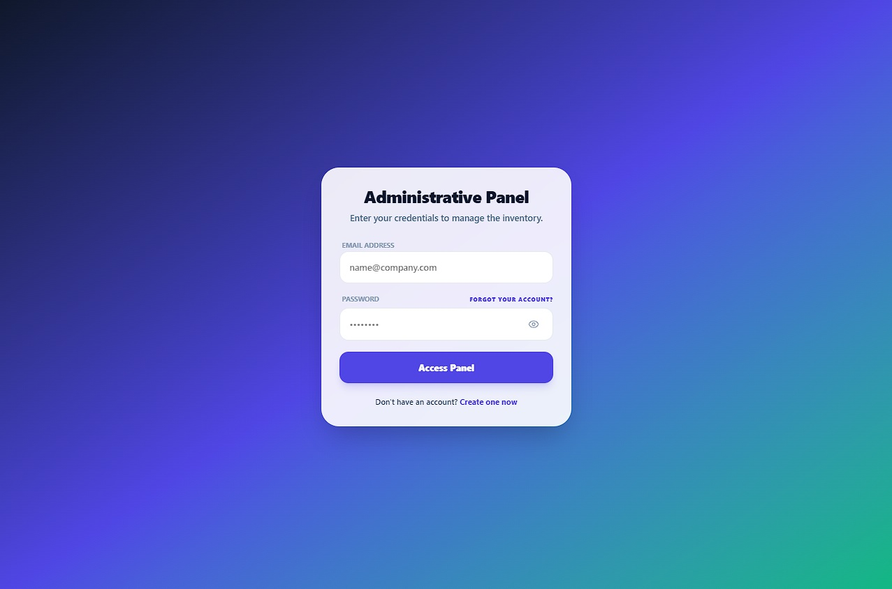
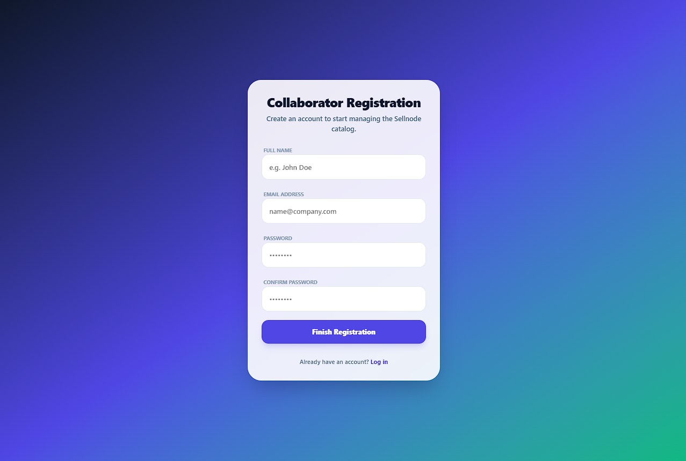
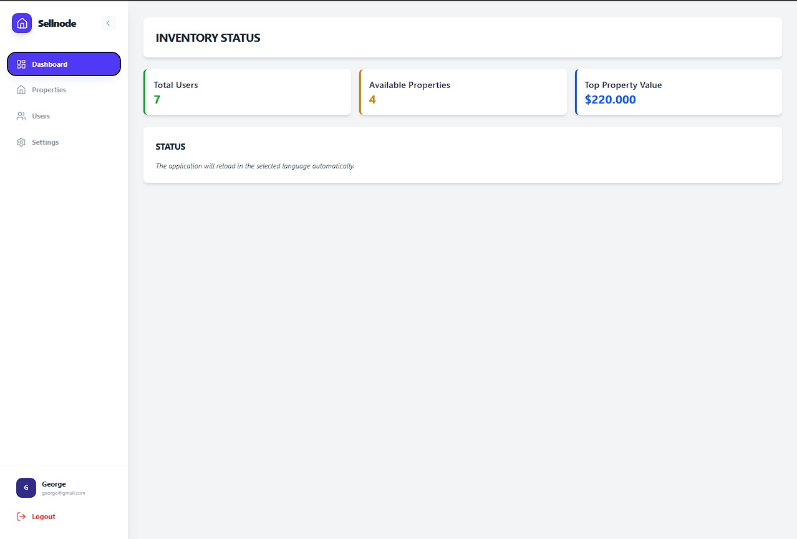
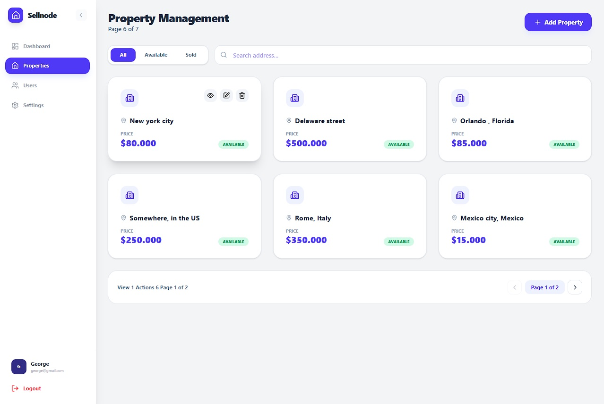
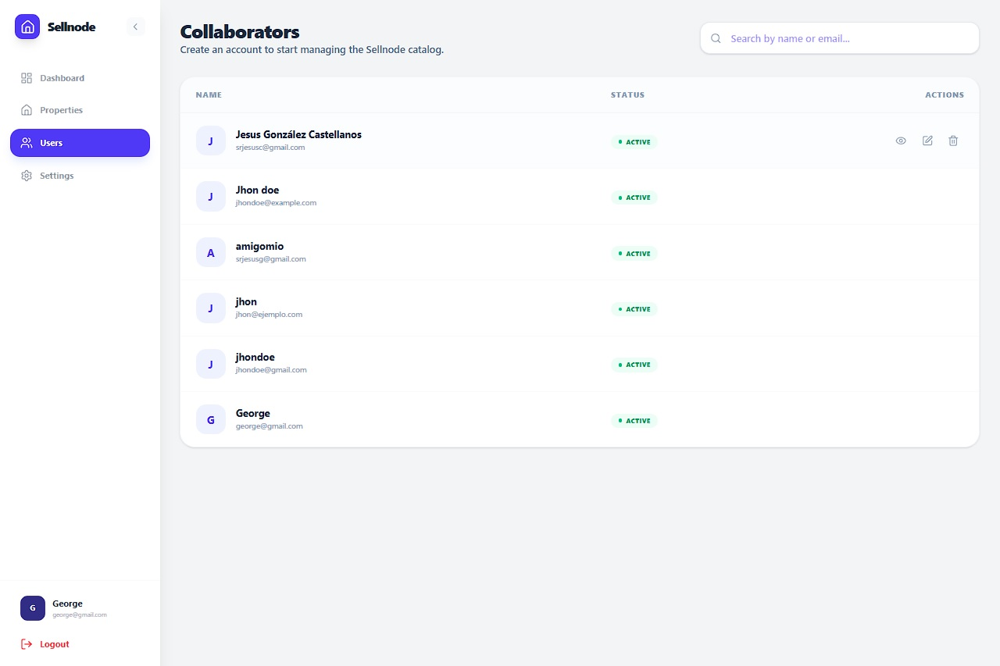
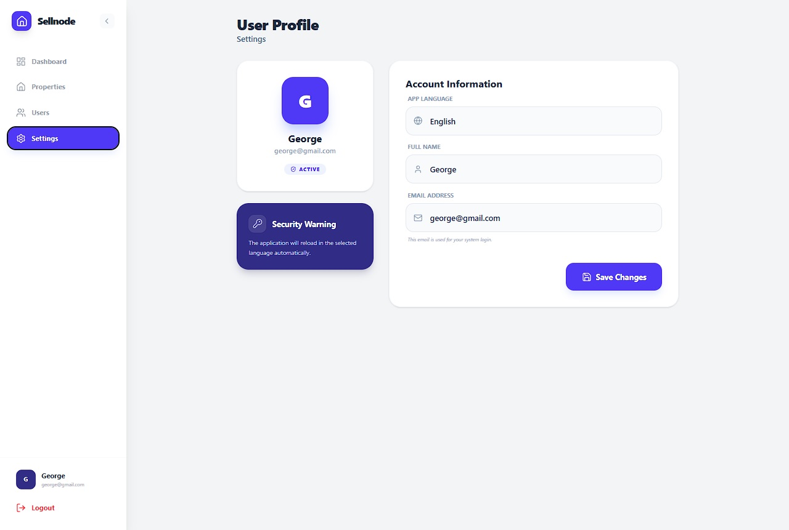

# Sellnode - Real Estate Management System


Sellnode is a comprehensive platform designed for real estate inventory administration and team management. It allows for exhaustive control over properties, their sales status, and collaborator access to the administrative system.

## Tech Stack
- **Frontend:** React + Vite + Tailwind CSS
- **Backend:** Node.js + Express
- **ORM:** Sequelize
- **Database:** PostgreSQL
- **Internationalization:** i18next (English / Spanish)

##  Security Focus
This project follows **OWASP** guidelines to ensure:
- **Robust Input Validation:** Preventing malicious data entry.
- **Secure Session Management:** Utilizing JWT (JSON Web Tokens) with secure storage.
- **SQL Injection Prevention:** Implemented through Sequelize ORM parameterization.
- **Password Hashing:** Using Bcrypt for high-standard credential protection.
- **Rate Limiting:** Protection against Brute Force and DoS attacks.

## Structure
```bash
real-estate-management/
├── server/                 # Backend Node.js
│   ├── src/
│   │   ├── config/         # DB (Sequelize) and variables
│   │   ├── controllers/    # Bussiness Logic
│   │   ├── middleware/     # Auth, ErrorHandler, Validations
│   │   ├── models/         # User, House
│   │   ├── routes/         #  Endpoints Def
│   │   └── app.js          # Entry points
│   ├── .env
│   └── package.json
├── client/                 # Frontend React (Vite)
│   ├── src/
│   │   ├── components/     # UI reusable
│   │   ├── context/        # AuthContext (Estado global)
│   │   ├── pages/          # Vistas (Login, Register, Dashboard)
│   │   ├── services/       # Axios API calls
│   │   └── utils/          # Helpers
│   ├── tailwind.config.js
│   └── package.json
└── README.md
```


## Features

- Property Management: Listing with real-time search, filtering by status, and pagination of 6 items per page.

- User Administration: Access control with table display and automatic scrolling for UI optimization.

- Security and Validation: Anti-XSS entry sanitization, strict 250-character limit per field, and validation of non-negative prices.

- Authentication: Secure login with password viewer and registration with two-factor authentication.


## Installation. 

1. Clone the repository.
```bash
clone https://github.com/tu-usuario/sellnode.git
cd sellnode
```
2. Configure the BackendBashcd server
```bash
npm install
```

# Configure your .env file with the credentials of PostgreSQL

```bash
npm run dev
```

3. Configure the FrontendBash
```bash
cd ../client
npm install
npm run dev
```
## 🗄️ Database Configuration

The application uses a PostgreSQL database named `real_estate_magnament`.  
Execute the following queries in the specified order:

### SQL Schema

```sql
-- 1. Enable extension for UUIDs
CREATE EXTENSION IF NOT EXISTS "uuid-ossp";

-- 2. Users Table
CREATE TABLE "Users" (
    "id" UUID PRIMARY KEY DEFAULT uuid_generate_v4(),
    "name" VARCHAR(255) NOT NULL,
    "email" VARCHAR(255) UNIQUE NOT NULL,
    "password" VARCHAR(255) NOT NULL,
    "isActive" BOOLEAN DEFAULT true,
    "createdAt" TIMESTAMP WITH TIME ZONE NOT NULL DEFAULT NOW(),
    "updatedAt" TIMESTAMP WITH TIME ZONE NOT NULL DEFAULT NOW()
);

-- 3. Properties Table
CREATE TABLE "Houses" (
    "id" UUID PRIMARY KEY DEFAULT uuid_generate_v4(),
    "address" TEXT NOT NULL,
    "price" DECIMAL(12, 2) NOT NULL,
    "status" VARCHAR(50) DEFAULT 'disponible',
    "sellerId" UUID REFERENCES "Users"("id") ON DELETE CASCADE,
    "createdAt" TIMESTAMP WITH TIME ZONE NOT NULL DEFAULT NOW(),
    "updatedAt" TIMESTAMP WITH TIME ZONE NOT NULL DEFAULT NOW()
);

```

### Seeds
Use this data to enable initial administrative access and test pagination:
Access: admin@sellnode.com | admin123
```bash
INSERT INTO "Users" ("name", "email", "password", "createdAt", "updatedAt")
VALUES ('Admin Sellnode', 'admin@sellnode.com', '$2b$10$Y56mXgJkE.TupYlUvUq7BuK7.eXGgQZ1VzG2iH0K6H3K6H3K6H3K6', NOW(), NOW());
```
-- Prove real state

```bash
INSERT INTO "Houses" ("address", "price", "status", "sellerId", "createdAt", "updatedAt")
VALUES 
('Avenida Los Próceres #45', 125000.00, 'disponible', (SELECT id FROM "Users" LIMIT 1), NOW(), NOW()),
('Calle Liminal 123', 85400.50, 'disponible', (SELECT id FROM "Users" LIMIT 1), NOW(), NOW()),
('Residencias Altamira 4B', 210000.00, 'vendido', (SELECT id FROM "Users" LIMIT 1), NOW(), NOW()),
('Sector La Morita, Casa 12', 45000.00, 'disponible', (SELECT id FROM "Users" LIMIT 1), NOW(), NOW()),
('Quinta Aurora, Las Delicias', 320000.00, 'disponible', (SELECT id FROM "Users" LIMIT 1), NOW(), NOW()),
('Calle Falsa 123', 15000.99, 'disponible', (SELECT id FROM "Users" LIMIT 1), NOW(), NOW()),
('Backrooms Level 0', 999.00, 'disponible', (SELECT id FROM "Users" LIMIT 1), NOW(), NOW());

```

## APIs

### 🔐 Authentication (Auth)

- **POST `/api/auth/login`**: Validates the credentials (email and password) of a collaborator to grant access to the dashboard.

- **POST `/api/auth/register`**: Registers a new user in the platform, storing their name, corporate email, and password.

### 🏠 Property Management (Houses)

- **GET `/api/houses`**: Retrieves the complete list of all properties registered in the inventory.

- **POST `/api/houses`**: Creates a new property record including data such as address, price, and initial status.

- **PUT `/api/houses/:id`**: Allows modifying existing data for a specific property (e.g., updating price or changing status to "sold").

- **DELETE `/api/houses/:id`**: Permanently deletes a property record from the database.

### 👥 User Administration (Users)

- **GET `/api/users`**: Obtains a list of all collaborators with access to the system.

- **PUT `/api/users/:id`**: Updates a collaborator's information, allowing changes to their name, email, or account activation/deactivation.

- **DELETE `/api/users/:id`**: Permanently removes a user from the administrative team.


## Future Improvements & Roadmap

To strengthen the robustness and user experience of Sellnode, the following implementations are suggested based on security and scalability best practices:

### 🔐 Advanced Security (OWASP Alignment)

- **CAPTCHA Implementation**: 
  - **Integrate Google reCAPTCHA or hCaptcha**: In the login form to mitigate automated credential stuffing and targeted brute-force attacks.

- **Two-Factor Authentication (2FA)**: Add an extra layer of security using TOTP (Time-based One-Time Password) codes generated in apps like Google Authenticator.

- **Progressive Lockout**: Implement backend logic to temporarily lock accounts after a specific number of failed attempts, complementing the current rate-limit.

### 📧 Identity & Communication Management

- **Email Verification**: 
  - Implement a registration flow where accounts remain inactive until the user confirms their identity via a verification link sent by email (using libraries like Nodemailer or services like SendGrid).

- **Password Recovery**: Develop a "Forgot Password" endpoint that generates single-use, short-lived JWT tokens for secure credential resetting via email.

- **Session Auditing**: Create a detailed log of IP addresses and devices accessing the system to detect suspicious activities early.

### 🏗️ System Scalability

- **Image Uploads**: 
  - Integrate cloud storage services (such as AWS S3 or Cloudinary) to allow users to upload actual property photographs instead of only text data.

- **Real-Time Notifications**: Use WebSockets (Socket.io) to instantly notify administrators when a collaborator registers a new sale or modifies a property.

 ## 🖼️ Project Gallery (Preview)

Below are actual screenshots of the **Sellnode** administrative interface, highlighting its modern, bilingual, and responsive design.

### 🔐 Authentication & Security
| Login Screen | Collaborator Registration |
| :---: | :---: |
|  |  |

### 📊 Management & Inventory
| Main Dashboard | Property Management |
| :---: | :---: |
|  |  |

### 👥 Team & Personalization
| Collaborator Management | Profile & Language Settings |
| :---: | :---: |
|  |  |

---
*This project was designed with a focus on User Experience (UX) and data security under modern Full-Stack development standards.*